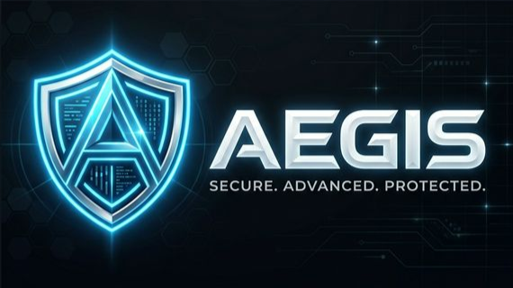
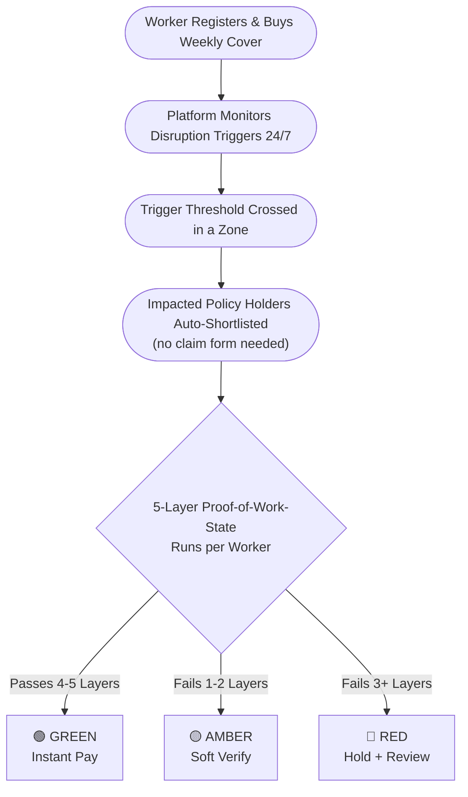

# 🛡️ Aegis — Anti-Spoof Parametric Income Protection

<br>

<div align="center">



**AUTOMATIC PAYOUTS FOR DISRUPTED DELIVERY WORKERS!**

<br>

[](https://github.com/aegis)
[](https://github.com/aegis)
[](https://github.com/aegis)
[](https://github.com/aegis)
[](https://github.com/aegis)

</div>

<br>

Aegis is a mobile-first, AI-powered parametric income protection platform for urban gig delivery workers. When a disruption event hits — a flood, a heatwave, a zone curfew — Aegis automatically validates affected workers using multi-signal **Proof-of-Work-State** verification and pays out without a claim form. Workers with coordinated GPS spoofing are detected and blocked through graph-based fraud ring analysis.

---

## Contents

1. [Market Crash Scenario](#market-crash-scenario)
2. [Problem Statement & Personas](#problem-statement--personas)
3. [Core Innovation: Proof-of-Work-State](#core-innovation-proof-of-work-state)
4. [Application Workflow](#application-workflow)
5. [Weekly Premium Model & Parametric Triggers](#weekly-premium-model--parametric-triggers)
6. [Platform Choice](#platform-choice)
7. [AI & ML Integration](#ai--ml-integration)
8. [Tech Stack](#tech-stack)
9. [Development Plan](#development-plan)

---

## Market Crash Scenario

### The Threat

A syndicate of **500 delivery workers** in a Tier-1 city exploited a beta parametric insurance platform. Coordinating via Telegram, they used GPS-spoofing applications to fake their presence inside a declared red-alert weather zone while remaining safely at home — triggering mass false payouts and draining the liquidity pool instantly.

Simple GPS verification is insufficient to prevent this class of attack. Aegis is designed from the ground up to neutralize it.

---

### **Adversarial Defense & Anti-Spoofing Strategy**

#### 1. Differentiating a Genuine Worker from a GPS Spoofer

A fraudster can fake coordinates. They cannot fake context.

Aegis runs a **5-Layer Proof-of-Work-State** check on every shortlisted claim:

| Layer | Signal | What We Detect |
|---|---|---|
| **1. Device Integrity** | SafetyNet / Play Integrity API, root/jailbreak flags, mock location app detection | Spoofing requires mock location permissions or a rooted device  flagged at the hardware level |
| **2. Motion Realism** | Accelerometer, gyroscope, pedometer | A stationary fraudster at home produces flat, dormant sensor traces; a genuinely stranded worker shows erratic, weather-consistent movement |
| **3. Shift Consistency** | Historical login times, order-accept patterns, zone-entry records | A worker with no history in the 2–5 AM slot filing a 3 AM disruption claim is anomalous |
| **4. Network & Cell Environment** | Cell tower triangulation, Wi-Fi BSSID, ISP/VPN fingerprint | Hundreds of accounts routing claims through the same IP block or cell cluster simultaneously is a definitive ring signature |
| **5. Platform Data Correlation** | Delivery platform dispatch signals, dark store operational status | Real disruptions produce measurable order volume drops; coordinated fake clusters do not correlate |

Failing 2 of 5 layers elevates a claim's risk score and triggers a soft review. Failing 3 or more results in an automatic hold.

---

#### 2. Detecting a Coordinated Fraud Ring

Beyond individual claim scoring, Aegis analyzes behavioral, device-level, and network-level fingerprints to identify ring-level coordination:

- **Device Fingerprint Clustering** — Claims from devices sharing the same hardware signature, Android ID, or advertising ID
- **IP & Network Cluster Analysis** — Groups of accounts resolving claims from the same subnet or cell tower simultaneously
- **Synchronized Claim Timing** — Coordinated rings submit within milliseconds of each other after a trigger fires
- **Motion Vector Uniformity** — Accounts showing statistically identical accelerometer traces are almost certainly scripted
- **Shift History Mismatch** — Claims filed for time-slots the worker has no history of working
- **Volume Spike Pattern** — Sudden claim surges following the statistical signature of a broadcast instruction

**Graph-Based Ring Detection:** Worker accounts are modeled as nodes; shared signals (IP, motion vector, device type) form edges. Connected components of 5 or more members filing simultaneous claims trigger a ring-level investigation all accounts in the cluster are held pending manual review.

---

#### 3. Handling Flagged Claims Without Penalizing Genuine Workers

The **3-Tier Trust Resolution System** is designed for fairness under real disruption conditions, where genuine workers may experience degraded connectivity:

| Tier | Condition | Resolution |
|---|---|---|
| 🟢 **GREEN** | Passes 4–5 layers, no ring signals | Instant automatic payout |
| 🟡 **AMBER** | Fails 1–2 layers for plausible environmental reasons (e.g., cell outage during a storm) | Lightweight soft verification one piece of evidence required. Payout within 24 hours |
| 🔴 **RED** | Fails 3+ layers or is part of a detected ring cluster | Payout hold. Escalated to admin dashboard for manual review. Worker notified with a transparent appeal path |

Verification friction scales with the anomaly score, not the weather severity. A worker with a 90-day clean history failing one network layer during a live storm is treated very differently from a new account failing four layers simultaneously.

---

## Problem Statement & Personas

### The Problem

Gig delivery partners in India lose income when external disruptions like heavy rain, floods, extreme heat, severe pollution, or zone curfews & stop them from working. Traditional insurance is:

- Too slow — claims take days or weeks to resolve
- Too documentation-heavy — incompatible with a gig worker's daily reality
- Not designed for income loss — standard policies cover property damage, not lost earning opportunity
- Misaligned with cash flow — gig workers earn weekly; annual premiums don't fit their financial rhythm

---

### Personas

#### Ravi — The Delivery Partner

| Attribute | Detail |
|---|---|
| Age | 24 years old |
| Platform | Blinkit (Q-Commerce) |
| City | Tier 1 :   Delhi, Mumbai, or Bengaluru |
| Monthly Earnings | ₹15,000–₹30,000, entirely performance-linked |
| Problem | A single day of rain or a zone curfew costs ₹600–₹1,200 with no safety net |
| Need | Affordable, automatic weekly income protection with no claim filing required |

**Why Q-Commerce?** Dense, hyperlocal delivery patterns make disruption impact immediate and measurable. Short work windows make trigger-based payouts verifiable. Rich device telemetry makes the anti-spoofing engine viable.

---

#### The Adversary - Fraud Syndicate

| Attribute | Detail |
|---|---|
| Profile | Organized group, 500+ members, coordinating via Telegram |
| Method | GPS spoofing apps, mock location tools, potentially rooted devices |
| Goal | Trigger mass parametric payouts during declared weather events to drain the insurance pool |
| Exploitable Weakness | Cannot simultaneously fake device integrity, motion context, shift history, and network fingerprints |

---

## Core Innovation: Proof-of-Work-State

Instead of asking *"Is this worker's GPS inside the affected zone?"*, Aegis asks: *"Does this worker's complete signal profile match the behavior of a genuinely disrupted delivery partner?"*

```
┌──────────────────────────────────────────────────────┐
│             PROOF-OF-WORK-STATE ENGINE               │
├──────────┬───────────────────────────────────────────┤
│ Layer 1  │ Device Integrity  (Root / Mock Detection) │
│ Layer 2  │ Motion Realism    (Accelerometer / Gyro)  │
│ Layer 3  │ Shift Consistency (Historical Patterns)   │
│ Layer 4  │ Network Context   (Cell / IP / VPN)       │
│ Layer 5  │ Platform Signals  (Dispatch Correlation)  │
├──────────┴───────────────────────────────────────────┤
│  Combined Trust Score  →  GREEN / AMBER / RED        │
└──────────────────────────────────────────────────────┘
```

No single layer can be exploited in isolation. A fraudster must simultaneously defeat device integrity checks, motion physics, shift history records, network fingerprints, and live platform API signals, an effectively impossible combination.

---

## Application Workflow



1. **Register & Cover** -  Worker signs up, links their delivery profile, and picks their active zones. A weekly risk profile is built from their historical patterns.
2. **Buy Weekly Protection** - Premium is calculated dynamically each week based on zone, time-slot, and trust history. No annual lock-in; opt out at any time.
3. **Continuous Monitoring** - The backend polls weather APIs, AQI feeds, government restriction feeds, and delivery platform health signals around the clock.
4. **Automatic Shortlisting** - When a disruption threshold is crossed, every active policy holder in the affected zone is queued for validation automatically.
5. **Multi-Signal Validation** - The Proof-of-Work-State engine scores each worker across all 5 layers asynchronously, in minutes.
6. **Tiered Resolution** - GREEN gets paid instantly. AMBER gets a soft verification request (one photo or screenshot). RED is held and escalated with full appeal rights.
7. **Payout** - Settled to wallet or bank within hours of event resolution, with no manual steps for the worker.

---

## Weekly Premium Model & Parametric Triggers

### Premium Model

Gig workers earn weekly. Aegis prices weekly.

```
Weekly Premium  =  Base Cover Cost
               +  Zone Risk Load          (city + delivery zone risk rating)
               +  Time-Slot Risk Load     (peak vs. off-peak work window)
               +  Disruption Frequency    (historical disruption rate in zone)
               −  Trust Discount          (clean claim history reward)
```

| Component | Description |
|---|---|
| Base Cover Cost | Minimum cost for the declared income coverage amount |
| Zone Risk Load | Higher for flood-prone or high-disruption zones |
| Time-Slot Risk Load | Higher for late-night or monsoon-peak slots |
| Disruption Frequency | Reflects historical event frequency in the zone |
| Trust Discount | Reduces cost for workers with verified clean claim histories |

---

### Parametric Triggers

All triggers are tied to income interruption, not property damage. Each threshold is objective and cross-verified against two independent API sources before activation.

| Trigger | Threshold |
|---|---|
| 🌧️ Severe Rain / Flood | Rainfall > 40mm/hour OR waterlogging in 3+ delivery zones |
| 🌡️ Extreme Heat | Wet-bulb temperature > 32°C OR heat index > 45°C in zone |
| 😷 Severe Pollution | AQI > 300 (Hazardous) for > 2 consecutive hours in zone |
| 🚧 Zone Closure / Curfew | Government-declared movement restrictions blocking pickup/delivery |
| 📉 Dispatch Failure | Platform order volume drops > 70% in a zone within a 1-hour window |

---

## Platform Choice

**Mobile app** for workers · **Web dashboard** for admins and insurers.

### Worker App - Mobile

The Proof-of-Work-State engine requires live accelerometer data, gyroscope readings, cell tower state, and device integrity APIs — none of which are accessible from a web browser. Mobile is a security requirement, not just a UX decision. The app also runs background passive monitoring, delivers push notification payouts, and caches state offline for areas with storm-degraded connectivity.

### Admin Dashboard - Web

Fraud network graphs, disruption heatmaps, cluster analytics, manual review queues, and compliance audit trails require the screen density and workflow tooling that a desktop web interface provides.

---

## AI & ML Integration

### Premium Risk Model
Predicts an optimized weekly premium per worker per zone using zone disruption history, time-slot risk, worker delivery history, and current weather forecasts. Trained with Gradient Boosting (XGBoost) for interpretable feature weights.

### Income Loss Estimation
Estimates probable lost earnings per disruption event from the worker's historical earnings in that time-slot and zone, weighted by a disruption severity index. Implemented as a time-series regression.

### Proof-of-Work-State Scorer
Scores each claim's authenticity across all 5 signal layers and produces a composite trust score (0–100) mapping to GREEN / AMBER / RED. Built as an ensemble of a deterministic rule engine, a Random Forest classifier, and an isolation-forest anomaly detector.

### Fraud Ring Detector
Maps worker accounts as graph nodes with shared-signal edges (IP, device fingerprint, motion vector). Applies DBSCAN clustering to find connected components; groups with 5+ members filing simultaneous claims are flagged as rings and all accounts are held simultaneously.

---

## Tech Stack

| Component | Technology | Purpose |
|---|---|---|
| Worker App |  | Cross-platform mobile; deep sensor and device integrity access |
| Admin Dashboard |   | Fraud analytics, network graphs, claims review |
| Backend |  | REST APIs for policy, trigger evaluation, and claims |
| Database |   | ACID records (policies, payouts) + real-time event queue |
| AI / ML |    | Anomaly scoring, premium prediction, ring detection |
| External APIs |   | Real-time environmental trigger data |
| Platform Integration |  | Simulated dispatch failure and zone status signals |
| Device Integrity |  | Hardware-level rooted device and mock location detection |

---

## Development Plan

The build is structured in three progressive stages - from strategy to working product to a fully hardened, analytically rich platform.

```
  ┌─────────────────────────────────────────────────────────────────┐
  │  Strategy & Design  →  Core Build  →  Analytics & Hardening    │
  └─────────────────────────────────────────────────────────────────┘
         ✅ Done              🔨 Next                ⏳ Upcoming
```

---

### ✅ Strategy & Design

The foundation — every architectural decision, fraud defense layer, and premium model is fully defined before a line of code is written.

- [x] Define target persona and use case
- [x] Specify all 5 parametric triggers and their objective thresholds
- [x] Design the weekly premium formula with all risk variables
- [x] Document the 5-Layer Proof-of-Work-State architecture
- [x] Design graph-based fraud ring detection logic
- [x] Document the 3-Tier Trust Resolution workflow
- [x] Publish strategy README

---

### 🔨 Core Build

Building the end-to-end product — the worker app, the trigger engine, the validation pipeline, and the payout flow.

- [ ] Worker mobile app — onboarding, zone selection, weekly policy purchase
- [ ] Parametric Trigger Engine — polling mock weather and AQI APIs
- [ ] 5-Layer Proof-of-Work-State scoring pipeline
- [ ] 3-Tier Payout Decision flow with AMBER soft-verification UX
- [ ] Fraud Anomaly Scoring Model v1 — trained and integrated
- [ ] Google Play Integrity API integration for device-level spoof detection

---

### ⏳ Analytics & Hardening

Closing the loop — fraud visibility, model refinement, and a polished demo experience.

- [ ] Web Admin Fraud Dashboard with network graph visualization
- [ ] DBSCAN-based Ring Detection model live in the pipeline
- [ ] Dynamic Premium Risk Model — per-worker, per-zone
- [ ] Full disruption event demo scenarios with UI polish
- [ ] End-to-end scenario demonstration including Market Crash simulation

---

